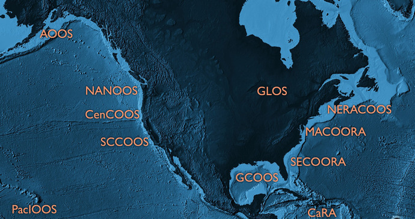

# `whoami`

Filipe Fernandes

>- Oceanógrafo Físico
>- Encanador de Dados
>- Faxineiro de Código
>- Babá de Teste Integrado Contínuo
>- Apertador do "botão verde" no conda-forge


# Outras versões dessa palestra: padrões

<iframe width="700" height="500" src="https://www.youtube.com/embed/BV30Sk1CrM0?start=1771" frameborder="0" allow="encrypted-media" allowfullscreen></iframe>

[https://www.youtube.com/watch?v=BV30Sk1CrM0](https://www.youtube.com/watch?v=BV30Sk1CrM0)


# Outras versões dessa palestra: Interoperabilidade de Dados/Modelos

<iframe width="700" height="500" src="https://www.youtube.com/embed/WHjU_rg81BI?start=1771" frameborder="0" allow="encrypted-media" allowfullscreen></iframe>

[https://www.youtube.com/watch?v=WHjU_rg81BI](https://www.youtube.com/watch?v=WHjU_rg81BI)


# IOOS




# IOOS em números


# Galeria de Código


[https://ioos.github.io/notebooks_demos/code_gallery](https://ioos.github.io/notebooks_demos/code_gallery)


# Falei de padrões né!?

<p>


</p>

>- evite soluções específicas
>- os padrões devem ser aplicados nos provedores de dados

. . .


# Serviços Web do IOOS

| Tipo de Dados                             | Serviço Web                       | Resposta     |
|-------------------------------------------|-----------------------------------|--------------|
| Dados *in-situ*<br>(bóias, estações, etc) | OGC SOS                           | XML/CSV      |
| Dados em grade (modelos, satélite)        | OPeNDAP                           | Binary       |
| Images *raster*                           | OGC WMS                           | GeoTIFF/PNG  |


. . .

`ERDDAP` "novo" padrão da comunidade.

# Sensor Observation Service (SOS)

(OGC SOS)

>- `GetCapabilities`: metadados
>- `DescribeSensor`: informação detalhada dos instrumentos
>- `GetObservation`: os dados


# SOS example

```python
url = (
    "https://opendap.co-ops.nos.noaa.gov/ioos-dif-sos/SOS?"
    "service=SOS"
    "&request=GetObservation"
    "&version=1.0.0"
    "&observedProperty=water_surface_height_above_reference"
    "&offering=urn:ioos:station:NOAA.NOS.CO-OPS:8454000"
    "&responseFormat=text/csv"
    "&eventTime=2018-07-04T00:00:00Z/2018-07-05T00:00:00Z"
    "&result=VerticalDatum==urn:ogc:def:datum:epsg::5103"
    "&dataType=PreliminarySixMinute"
)
```

# Com uma Pytada de Python

```python
url = (
    f"https://opendap.co-ops.nos.noaa.gov/ioos-dif-sos/SOS?"
    f"service=SOS&request={request}"
    f"&version={version}"
    f"&observedProperty={variable}"
    f"&offering=urn:ioos:station:NOAA.NOS.CO-OPS:8454000"
    f"&responseFormat={response}"
    f"&eventTime={yesterday:%Y-%m-%dT%H:%M:%SZ}/"
    f"{today:%Y-%m-%dT%H:%M:%SZ}"
    f"&result=VerticalDatum=={vdatum}"
    f"&dataType={data_type}"
)
```

. . .

<a href="https://mybinder.org/v2/gh/ocefpaf/2019-10-27-PyBr-talk/gh-pages?filepath=notebooks/00-SOS.ipynb">
  
</a>


# OPeNDAP/Climate and Forecast

(CF)

<iframe src="http://cfconventions.org/" width="750px" height="450px"></iframe>

# Metadados CF

```xml
float temp(ocean_time, s_rho, eta_rho, xi_rho);
    temp:standard_name = "sea_water_potential_temperature"
    temp:units = "Celsius";
    temp:coordinates = "lon_rho lat_rho s_rho ocean_time";
double s_rho(s_rho);
    s_rho:long_name = "S-coordinate at RHO-points";
    s_rho:positive = "up";
    s_rho:standard_name = "ocean_s_coordinate_g1";
    s_rho:formula_terms = "s:s_rho C:Cs_r eta:zeta depth:h
                           depth_c:hc"
```

. . .

<a href="https://mybinder.org/v2/gh/ocefpaf/2019-10-27-PyBr-talk/gh-pages?filepath=notebooks/01-ClimateForecast.ipynb">
  
</a>


# Web Mapping Service

(OGC WMS)

>- Interface HTTP simples para requerer images geo-referenciadas sobre um mapa
>- Um pedido WMS define uma camada geográfica e uma área de interesse a ser processada
>- A reposta ao pedido é um ou mais mapas images geo-referênciadas (retornadas como JPEG ou PNG)

. . .

<a href="https://mybinder.org/v2/gh/ocefpaf/2019-10-27-PyBr-talk/gh-pages?filepath=notebooks/02-WMS.ipynb">
  
</a>

# ERDDAP

O servidor de dados que a comunidade pedia

>- Retornos flexíveis: `.html` table, ESRI `.asc` and `.csv`, Google Earth `.kml`, OPeNDAP binary, `.mat`, `.nc`, ODV `.txt`, `.csv`, `.tsv`, `.json`, and `.xhtml`
>- RESTful API "de graça" para acessar os dados
>- Padroniza as datas e tempo em buscas e retornos
>- Redução de dados "no servidor"

. . . 

<a href="https://mybinder.org/v2/gh/ocefpaf/2019-10-27-PyBr-talk/gh-pages?filepath=notebooks/03-ERDDAP.ipynb">
  
</a>


# Existem muitas partes móveis


# Catalog Service for the Web

(CSW)

>- Uma fonte única para encontrar os *endpoints*
>- Tem interface Python:<br>`owslib.csw.CatalogueServiceWeb`
>- Permite filtros avançados:<br>`owslib.fes`

. . . 


# Como ele é alimentado


# Procurando os serviços web


```python
>>> from geolinks import sniff_link
>>> sniff_link("https://host/wms?service=SOS")
'OGC:SOS'
>>> sniff_link("https://host/wms?service=OPeNDAP:OPeNDAP")
'OPeNDAP:OPeNDAP'
>>> sniff_link("https://host/wms?service=WMS")
'OGC:WMS'
>>> sniff_link("https://host/data/roads.kmz")
'OGC:KML'
>>> sniff_link("https://host/data/roads.kml")
'OGC:KML'
```

. . .

<a href="https://mybinder.org/v2/gh/ocefpaf/2019-10-27-PyBr-talk/gh-pages?filepath=notebooks/04-CSW.ipynb">
  
</a>


# Juntando Tudo: NHC

Encontrando estações meteorológicas no caminho de previsão de um furacão.

<a href="https://mybinder.org/v2/gh/ocefpaf/2019-10-27-PyBr-talk/gh-pages?filepath=notebooks/2017-09-09-hurricane_irma.ipynb">
  
</a>


# Juntando Tudo: Avaliando Performance de Modelos

Checando modelos de altura de ondas

<a href="https://mybinder.org/v2/gh/ocefpaf/2019-10-27-PyBr-talk/gh-pages?filepath=notebooks/2018-03-30-wave_height_assessment.ipynb">
  
</a>

# Juntando Tudo: ERDDAP App

Finalmente o notebook que prometi no título!

<a href="https://mybinder.org/v2/gh/ocefpaf/2019-10-27-PyBr-talk/gh-pages?filepath=notebooks/ERDDAP_timeseries_explorer-IOOS.ipynb">
  
</a>


# Portal SECOORA

<iframe width="700" height="500" src="https://portal.secoora.org"></iframe>


# Sumário

>- Padrões, serviços web e catálogos permitem servir dados de forma "unificada"
>- Python é talvez a única linguagem científica+web+dashboard+scripting que nos permite criar protótipos de visualização tão rapidamente unindo tantas tecnologias diferentes
>- Widgets nos permite democratizar a explorações dos dados


# Perguntas?

#### (ocefpaf)


[https://ocefpaf.github.io/2019-10-27-PyBr-talk](https://ocefpaf.github.io/2019-10-27-PyBr-talk)

[![Pangeo Binder](https://img.shields.io/badge/pangeo-binder-2F7651.svg?logo=data:image/png;base64,iVBORw0KGgoAAAANSUhEUgAAAFkAAABZCAMAAABi1XidAAAB8lBMVEX///9XmsrmZYH1olJXmsr1olJXmsrmZYH1olJXmsr1olJXmsrmZYH1olL1olJXmsr1olJXmsrmZYH1olL1olJXmsrmZYH1olJXmsr1olL1olJXmsrmZYH1olL1olJXmsrmZYH1olL1olL0nFf1olJXmsrmZYH1olJXmsq8dZb1olJXmsrmZYH1olJXmspXmspXmsr1olL1olJXmsrmZYH1olJXmsr1olL1olJXmsrmZYH1olL1olLeaIVXmsrmZYH1olL1olL1olJXmsrmZYH1olLna31Xmsr1olJXmsr1olJXmsrmZYH1olLqoVr1olJXmsr1olJXmsrmZYH1olL1olKkfaPobXvviGabgadXmsqThKuofKHmZ4Dobnr1olJXmsr1olJXmspXmsr1olJXmsrfZ4TuhWn1olL1olJXmsqBi7X1olJXmspZmslbmMhbmsdemsVfl8ZgmsNim8Jpk8F0m7R4m7F5nLB6jbh7jbiDirOEibOGnKaMhq+PnaCVg6qWg6qegKaff6WhnpKofKGtnomxeZy3noG6dZi+n3vCcpPDcpPGn3bLb4/Mb47UbIrVa4rYoGjdaIbeaIXhoWHmZYHobXvpcHjqdHXreHLroVrsfG/uhGnuh2bwj2Hxk17yl1vzmljzm1j0nlX1olL3AJXWAAAAbXRSTlMAEBAQHx8gICAuLjAwMDw9PUBAQEpQUFBXV1hgYGBkcHBwcXl8gICAgoiIkJCQlJicnJ2goKCmqK+wsLC4usDAwMjP0NDQ1NbW3Nzg4ODi5+3v8PDw8/T09PX29vb39/f5+fr7+/z8/Pz9/v7+zczCxgAABC5JREFUeAHN1ul3k0UUBvCb1CTVpmpaitAGSLSpSuKCLWpbTKNJFGlcSMAFF63iUmRccNG6gLbuxkXU66JAUef/9LSpmXnyLr3T5AO/rzl5zj137p136BISy44fKJXuGN/d19PUfYeO67Znqtf2KH33Id1psXoFdW30sPZ1sMvs2D060AHqws4FHeJojLZqnw53cmfvg+XR8mC0OEjuxrXEkX5ydeVJLVIlV0e10PXk5k7dYeHu7Cj1j+49uKg7uLU61tGLw1lq27ugQYlclHC4bgv7VQ+TAyj5Zc/UjsPvs1sd5cWryWObtvWT2EPa4rtnWW3JkpjggEpbOsPr7F7EyNewtpBIslA7p43HCsnwooXTEc3UmPmCNn5lrqTJxy6nRmcavGZVt/3Da2pD5NHvsOHJCrdc1G2r3DITpU7yic7w/7Rxnjc0kt5GC4djiv2Sz3Fb2iEZg41/ddsFDoyuYrIkmFehz0HR2thPgQqMyQYb2OtB0WxsZ3BeG3+wpRb1vzl2UYBog8FfGhttFKjtAclnZYrRo9ryG9uG/FZQU4AEg8ZE9LjGMzTmqKXPLnlWVnIlQQTvxJf8ip7VgjZjyVPrjw1te5otM7RmP7xm+sK2Gv9I8Gi++BRbEkR9EBw8zRUcKxwp73xkaLiqQb+kGduJTNHG72zcW9LoJgqQxpP3/Tj//c3yB0tqzaml05/+orHLksVO+95kX7/7qgJvnjlrfr2Ggsyx0eoy9uPzN5SPd86aXggOsEKW2Prz7du3VID3/tzs/sSRs2w7ovVHKtjrX2pd7ZMlTxAYfBAL9jiDwfLkq55Tm7ifhMlTGPyCAs7RFRhn47JnlcB9RM5T97ASuZXIcVNuUDIndpDbdsfrqsOppeXl5Y+XVKdjFCTh+zGaVuj0d9zy05PPK3QzBamxdwtTCrzyg/2Rvf2EstUjordGwa/kx9mSJLr8mLLtCW8HHGJc2R5hS219IiF6PnTusOqcMl57gm0Z8kanKMAQg0qSyuZfn7zItsbGyO9QlnxY0eCuD1XL2ys/MsrQhltE7Ug0uFOzufJFE2PxBo/YAx8XPPdDwWN0MrDRYIZF0mSMKCNHgaIVFoBbNoLJ7tEQDKxGF0kcLQimojCZopv0OkNOyWCCg9XMVAi7ARJzQdM2QUh0gmBozjc3Skg6dSBRqDGYSUOu66Zg+I2fNZs/M3/f/Grl/XnyF1Gw3VKCez0PN5IUfFLqvgUN4C0qNqYs5YhPL+aVZYDE4IpUk57oSFnJm4FyCqqOE0jhY2SMyLFoo56zyo6becOS5UVDdj7Vih0zp+tcMhwRpBeLyqtIjlJKAIZSbI8SGSF3k0pA3mR5tHuwPFoa7N7reoq2bqCsAk1HqCu5uvI1n6JuRXI+S1Mco54YmYTwcn6Aeic+kssXi8XpXC4V3t7/ADuTNKaQJdScAAAAAElFTkSuQmCC)](https://binder.pangeo.io/v2/gh/ocefpaf/2019-10-27-PyBr-talk/gh-pages)
